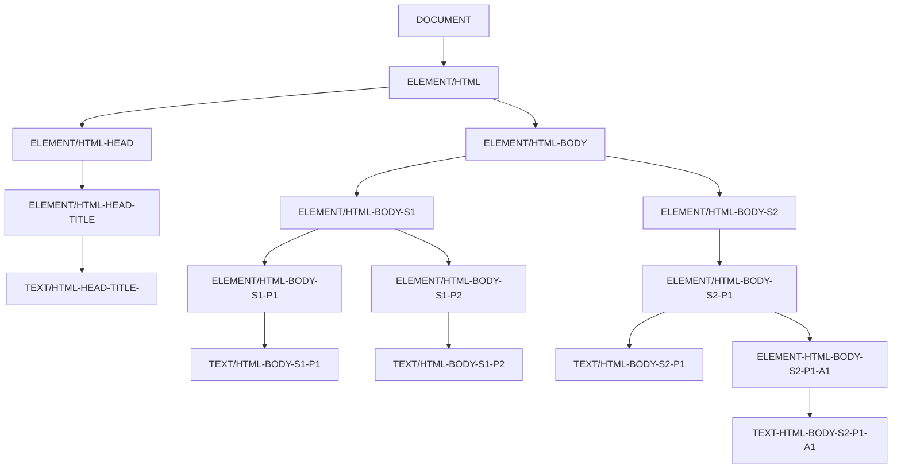
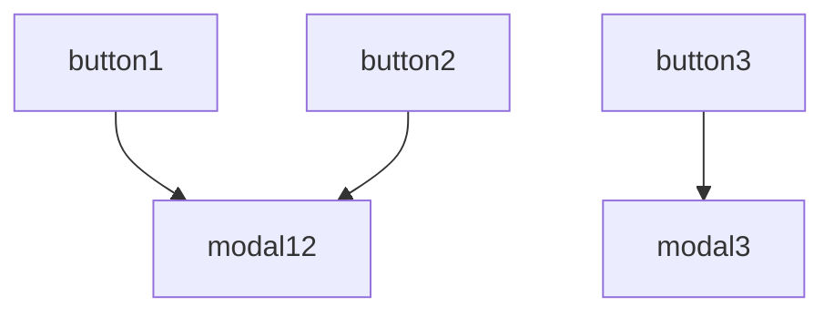

# **JavaScript**

Author: Sun Lu

This is a notebook on JavaScript programming. The notebook is based on following materials:

- Jonas Schmedtmann, _The Complete JavaScript Course 2023: From Zero to Expert!_, Udemy

The program is tested on a PC with RHEL 9.1.

---

# What Is JavaScript

JavaScript is a high-level object-oriented computer programming language. It is widely used in building web applications, both front-end and back-end, for both desktop or mobile devices. It is also one of the most widely used computer programming language for general purposes.

For example, consider a web page. HTML records the content of the web page, while CSS determines the presentation of the content. JavaScript is the actual logics integrated into the web page which makes it not only a static poster but a interactive application with data transmission. For example, JavaScript can respond to the button clicks on the web page, retrieve data from a remote server, and subsequently display the data on the in a dynamic manner.

A new version of JavaScript is released every year, with the release name "ES20XX" where "XX" is the release year. JavaScript has a well designed backwards compatible compatible, which means an old JavaScript program can always run on a new browser. The reverse is not true.

# JavaScript Runtime Setup

## Browser-Based JavaScript Runtime

Many web browsers, including Microsoft Edge and Google Chrome, have so called "developer tools" that allows the user to check and test JavaScript codes using the browser. The outcome of the code can be immediately displayed on the browser.

Take Microsoft Edge as an example. To setup a browser-based JavaScript runtime on Edge, open a blank page with URL `about:blank`. Then press `F12` to open the developer tools. Select "Console" in the developer tools. The user can then test JavaScript codes using the console.

For quick demonstration, type the following in the console

```js
alert("Hello World!");
```

then press `Enter`. An alert message that says "Hello World!" shall pop up.

Another example where an `if` statement is used is given below.

```js
let js = "show";
if (js === "show") alert("Hello World Again!");
```

A message box that says "Hello World Again!" shall pop up.

## VSCode-Based JavaScript Runtime

Microsoft Visual Studio Code (VSCode) is a very powerful and flexible text and program editor. Download and install Microsoft Visual Studio Code from [here](https://code.visualstudio.com/).

VSCode is able to automatically detect and color-code html and JavaScript files.

## Integration of JavaScript into HTML

In many applications, JavaScript is commonly "attached" in html files, where `<script></script>` is used to wrap the JavaScript code. The browser shall be able to comprehend the content of the JavaScript code when loading the web page. An example is given below.

```html
<!DOCTYPE html>
<html lang="en">
  <head>
    <meta charset="UTF-8" />
    <title>Web Page Example</title>
    <script>
      let js = "flag";
      if (js === "flag") alert("Welcome to JavaScript!");
    </script>
  </head>
  <body>
    <h1>This is an example web page.</h1>
  </body>
</html>
```

where

```html
<script>
  let js = "flag";
  if (js === "flag") alert("Welcome to JavaScript!");
</script>
```

is a piece of JavaScript code integrated into the html file. This should pop up an alert message that says "Welcome to JavaScript!" each time the page is refreshed.

When the JavaScript code becomes complicated, it is often more convenient to save the script in a separate file than using the inline script, and call that script in the html file. As an example, create a file `script.js` under the same folder with the html file as follows.

```js
let js = "amazing";
if (js === "amazing") alert("Welcome to JavaScript!");
```

In the html file, use

```html
<script src="script.js"></script>
```

to replace the inline script. It should work all the same.

## Strict Mode

By activating strict mode, JavaScript forbids particular actions or operations in the script, and pop up error message for any suspicious-looking code which, if were in the normal mode, would stay silence until the script fails. It helps with good programming practice and easy debugging.

For example, strict mode enforce declaring a variable (using `let`, for example) before updating one. It thus helps to pick up variables without initially declared probably due to mistyping. It also reserves words such as `interface`, `private`, that should not be used to name common variables in a good practice.

To enable strict mode, in the very first line of the JavaScript, use

```js
"use strict";
```

## JavaScript Comments

Use

```js
// comment
```

for single-line comments, and

```js
/*
comment
comment
comment
*/
```

for multiple-line comments.

# JavaScript Variables and Operators

## Variables

The syntax of declaring a variable and assigning a value to the variable is

```js
let <variableName> = <val>;
```

where `val` is the value assigned to the variable. There are many data types defined in JavaScript, to name a few, string `'apple'`, `"apple"`, or numeric number `0`, `100`, `0.5`. More will be introduced later.

Notice that JavaScript uses camelCase notation to name variables (and UPPERCASE notion for constants) as a convention. Like many other languages, JavaScript reserved keywords cannot be used as variable names.

The following table summarizes the commonly used primitive data types.

| Data Type | Explanation                                                        | Example            |
| :-------- | :----------------------------------------------------------------- | :----------------- |
| Number    | Floating point numerical numbers, both integers and decimals.      | `let x = 1;`       |
| String    | Sequence of characters.                                            | `let x = "apple";` |
| Boolean   | Logic true or false.                                               | `let x = true;`    |
| Undefined | Empty value.                                                       | `let x;`           |
| Null      | Empty value, used in different circumstances from undefined value. |                    |
| Symbol    | Unique and static value.                                           |                    |
| BigInt    | Big integer value.                                                 |                    |

JavaScript uses dynamic typing. A variable can be assigned with value without declaring the data type in advance.

Use `typeof` followed by a variable to return its type. For example,

```js
let x = 3;
typeof x;
```

the second line of the above code would return a string that says `"number"`. If `x` is assigned with another value of a different data type, the `typeof` return would also change. An example is given below.

```js
let x = 3;
typeof x; // return "number"
x = true;
typeof x; // return "boolean"
x = "javascript";
typeof x; // return string
```

In the demonstration so far, `let` has been used to declare a new variable. It is used only in the first instance when the variable is declared. It is not allowed to use `let` to declare multiple variables with the same name, or to update variables. This setup helps to prevent defining a new variable with the same time as an existing variable without noticing it, hence accidentally overwriting the existing one.

There are other ways than using `let` to declare a variable, such as using `var`. These methods are introduced as follows.

- `let` is used to declare a variable whose value and data type can change later (mutable). It is allowed to declare an undefined variable using `let`, and later update its value.
- `const` is used to declare a constant whose value cannot be changed (immutable).
- `var` legacy way of declaring variables. Its usage looks similar `let`, but it has a different mechanism behind screen.
- Without using a keyword for declaring new variable. This defines the variable under the global object, but not the current program block. It is NOT recommended.

An example is given below.

```js
const birthYear = 1991; // never change
let age;
age = 2023 - 1991;
```

## Operators

Arithmetic operators are supported in JavaScript. Examples are given below.

```js
const birthYearLu = 1991;
const birthYearZhe = 1992;
const ageDiff = birthYearZhe - birthYearLu;
let nowYear = 2023;
let ageLu = currentYear - birthYearLu;
```

Widely used supported arithmetic operators include `+`, `-`, `*`, `/`, `**` (to the power of). In addition, `=` is also an operator, namely the assign operator, which is widely used in all circumstances. Other assign operators are `+=`, `*=`, `++`, `--`, etc.

Comparison operators are supported, including `>`, `<`, `>=`, `<=`, `==`, `!=`, `===`, `!==` etc. The return of a comparison operator is a boolean value.

String operators are supported. For example, `+` can be used to concatenate strings. An example is given below.

```js
const firstName = Lu;
const lastName = Sun;
const fullName = lastName + " " + fullName;
```

The operators can be using in a nested manner, in which case the sequence with which operators are executed follows the pre-defined operator precedence. Details are given [here](https://developer.mozilla.org/en-US/docs/Web/JavaScript/Reference/Operators/Operator_Precedence).

## Template Literals for String Operation

To form a string with variables integrated inside, using string concatenate `+` can be inconvenient, especially when managing the spaces. The template literals can be used to handle this problem. An example is given below.

```js
let x = 10;
let y = 20;
let msg =
  "The values of x and y are " +
  x +
  " and " +
  y +
  ", respectively. \n The sum is " +
  (x + y) +
  ".";
```

Alternatively, consider using template literals as follows. It simplifies integrating of variables, calculations, and line switches in a string.

```js
let x = 10;
let y = 20;
let msg = `The values of x and y are ${x} and ${y}, respectively. 
The sum is ${x + y}.`;
```

Notice that to use template literals, use \` to quote the string instead of the regular quotation marks. There are developers using \` for any string any way, regardless of whether template literals are used.

## Type Conversion and Coercion

Values of different types might be converted from one type to another. For example, a string `'1991'` can be converted to number `1991`. The developer may manually convert the data using functions, in which case it is called a "conversion", or the JavaScript interpreter may do that conversion automatically behind the screen in some operations, in which case it is called a "coercion".

An example of conversion and coercion is given below.

```js
let x = "1991";
let y = x + 1992; // y is a string says '19911992'
let z = Number(x) + 1992; // z is a number of 3983;
```

where in calculating `y`, JavaScript converts number `1992` into a string `'1992'` by coercion, then concatenate it with string `x` to get `19911992`. In calculating `z`, string `x` is first converted into number `1991`, then added with another number `1992` to get `3983`.

Use `Number()` to convert a string to a number. In the case where the string does not make sense, `NaN` is returned. Use `String()` to convert a number to a string.

Notice that though data coercion is convenient, it is sometimes not very intuitive. Examples are given below.

```js
let x;
x = "1991" + "1992"; // string, '19911992'
x = "1991" + 1992; // string, '19911992'
x = "1991" - "1992"; // number, -1
x = "1991" - 1992; // number, -1
```

Apparently, JavaScript is taking `+` as string concatenate operator over arithmetic operator, and numbers are converted into strings. When comes to `-`, since there is no corresponding string operator, it is treated as an arithmetic operator, and strings are converted into numbers.

Variables of other types can be converted to boolean type using `Boolean()`. Boolean coercion also happens frequently wherever an IF statement is used.

Only the following values are converted to `false`, and everything else would become `true`. They are: `0`, `''` (empty string), `undefined`, `null`, and `NaN`. Notice that empty object `{}` is converted to true. More about object is introduced in later part of the notebook.

# Functions

Functions are one of the most important building blocks of all modern programming languages. It allows reuse of codes, hence making the program efficient to program and easy to read. It also avoids repeatedly saving the same code in the storage.

Regular **function declaration**, **anonymous function expression**, and **array function** are introduced. The basic syntax of defining a function is as follows. The input list and return are optional.

```js
function <function-name>(<input1>, <input2>) {
  <statement>;
  <statement>;
  return <expression>;
}
```

The above is called a function declaration. A function can be called both before and after its associated function declaration.

Define an anonymous function as fellows.

```js
 const <function-name> = function (<input1>, <input2>) {
  <statement>;
  <statement>;
  return <expression>;
 }
```

The above is called a function expression. It allows to store a function into a "variable". A function can be called after the function expression variable is defined.

Define an array function as follows.

```js
const <function-name> = <input1> => <expression>
```

In the case where there are multiple inputs, use `(<input1>, <input2>)` instead. The bracket is required in this case.

Examples of an array function is given below.

```js
const calculateAge = (birthYear) => 2023 - birthYear;
const age = calculateAge(1991); // age = 32
const calculateUntilRetirement = (birthYear) => {
  const age = 2023 - birthYear;
  const retirement = 65 - age;
  return retirement;
};
const tillRetirement = calculateUntilRetirement(1991); // tillRetirement = 33
```

# Data Structure

Array and object are the most important data structures in JavaScript. They are introduced as follows.

## Array

Define an array as follows.

```js
<array> = [<variable>, <variable>];
```

Examples are given below.

```js
const friend1 = "Michael";
const friend2 = "Steven";
const friend3 = "Peter";
const friendArray = [friend1, friend2, friend3]; // array of string
const ageArray = [21, 23, 19]; // array of number
```

It is possible to declare an empty array by assigning value `[]`. The elements can be added later.

To access an array, use `<array>[<index>]`, which can be used to either return an element value, or to update that element. The index starts from 0. The length of an array is given by its property `.length`. For example,

```js
const ageArray = [21, 23, 19];
const firstAge = ageArray[0]; // returns 21
const lengthAge = ageArray.length; // returns 3
const lastAge = ageArray[lengthAge - 1]; // returns 19
```

Array is mutable. Even if an array is declared `const`, the value of its element can be changed. However, the array of the same name cannot be reclaimed. An example is given below.

```js
const ageArray = [21, 23, 19];
ageArray[2] = 29; // ageArray = [21, 23, 29]
```

Array can have mixed data types. An array by itself can be an element of another array. An example is given below.

```js
const ageArray = [21, 23, 19];
const arrayExpand = [28, 16, 31, ageArray, "John"]; // arrayExpand = [28, 16, 31, Array(3), 'John']
```

Notice that the calculation involving number array may not function as expected in other languages such as Python. For example, `<number>+<array>` would populate that number and add it to each and every element in the array in Python. But it does not work like that in JavaScript. Instead, each element in the array needs to be handled independently.

## Array Methods

To add an element to the end an array, use `.push(<variable>)` method. To add it to the beginning of an array, use `.unshift(<variable>)`. These method returns the new length of the array. An example is given below.

```js
const x = [1, 2, 3, 4, 5];
let newLength = x.push(6); // x = [1,2,3,4,5,6]; newLength = 6
newLength = x.unshift(0); // x = [0,1,2,3,4,5,6]; newLength = 7
```

To remove the last element, use `.pop()`. To remove from the beginning of the array, use `.shift()`. They return the removed element.

To search for the index of an element, use `.indexOf(<element>)`. An example is given below.

```js
const x = [1, 2, 3, 4, 5];
x.indexOf(3); // 2, because x[2] = 3
x.indexOf(10); // -1, when not found
x.push(3);
x.indexOf(3); // 2, because x[2] = 3 is its first appearance
```

To simply check whether element exists in an array, use `.include(<element>)`, which will return a boolean value. Strong equality is required in the comparison. An example is given below.

```js
const x = [1, 2, 3, 4, 5];
x.include(1); // true
x.include("5"); // false
```

## Object

Object is one of the main data structures used in JavaScript. In some sense, array can also be taken as a special type of object.

JavaScript uses "key-value" pairs to store data in a regular object. The syntax follows JavaScript Object Notation (JSON), which is shown below. Notice that there are other ways to create JavaScript objects.

```js
const <object> = {
  key: value,
  key: value
}
```

An example of defining an object is given below.

```js
const harryPotter = {
  firstName: "Harry",
  lastName: "Potter",
  school: "Gryffindor",
};
```

Then use `<object>.<property>` or `<object>[<'property'>]` to access the property of an object, where the dot "`.`" is in fact an operator. For example,

```js
const harryPotter = {
  firstName: "Harry",
  lastName: "Potter",
  school: "Gryffindor",
};
harryPotter.school; // 'Gryffindor'
harryPotter["school"]; // 'Gryffindor'
harryPotter.teacher; // undefined, as this property is not defined
harryPotter["teacher"]; // undefined, as this property is not defined
```

The above can be used to update or add new properties to an existing object.

## Object Methods

Object can have properties of different value types, array, other objects, and even functions. To add a function as a property to an object, use the function name as the key, and the expression of the function as the value. An example is given below.

```js
const harryPotter = {
  firstName: "Harry",
  lastName: "Potter",
  birthYear: 1980,
  calculateAge: function (currentYear) {
    return currentYear - 1980;
  },
};
harryPotter.calculateAge(2023); // returns 43
```

It is possible to use the defined property in the function as well. An example is given below. Notice that `this` is used to refer to the current object being initialized in a function. It is also possible to add new properties to the object from its function using `this`.

```js
const harryPotter = {
  firstName: "Harry",
  lastName: "Potter",
  birthYear: 1980,
  calculateAge: function (currentYear) {
    this.age = currentYear - this.birthYear;
    return this.age;
  },
};
harryPotter.age; // return undefined
harryPotter.calculateAge(2023); // returns 43
harryPotter["calculateAge"](2023); // return 43
harryPotter.age; // return 43
```

However, the same does not apply to property definition. For example, the following code would not work.

```js
const harryPotter = {
  firstName: "Harry",
  lastName: "Potter",
  birthYear: 1980,
  fullName: firstName + " " + lastName, // error; firstName and lastName are not defined
  calculateAge: function (currentYear) {
    return currentYear - this.birthYear;
  },
};
```

```js
const harryPotter = {
  firstName: "Harry",
  lastName: "Potter",
  birthYear: 1980,
  fullName: this.firstName + " " + this.lastName, // fullName = "undefined undefined"
  calculateAge: function (currentYear) {
    return currentYear - this.birthYear;
  },
};
```

The correct way is as follows.

```js
const harryPotter = {
  firstName: "Harry",
  lastName: "Potter",
  birthYear: 1980,
  calculateAge: function (currentYear) {
    return currentYear - this.birthYear;
  },
};
harryPotter.fullName = harryPotter.firstName + " " + harryPotter.lastName;
harryPotter.fullName; // "Harry Potter"
```

Or alternatively,

```js
const harryPotter = {
  firstName: "Harry",
  lastName: "Potter",
  birthYear: 1980,
  calculateAge: function (currentYear) {
    this.age = currentYear - this.birthYear;
    return this.age;
  },
  calculateFullName: function () {
    this.fullName = this.firstName + " " + this.lastName;
  },
};
harryPotter.calculateFullName();
harryPotter.fullName; // "Harry Potter"
```

# Control Structure

## IF Statement

The control structure syntax of using an IF statement is shown below.

```js
if (<expression>) {
  <statement>;
  <statement>;
} else if {
  <statement>;
  <statement>;
} else {
  <statement>;
  <statement>;
}
```

In case where there is only one line of command in the code block in the IF statement, the curly bracket is not required.

In the above, `<expression>` a series of comparison operation formed by `==` (loose equality), `!=`(loose inequality), `===` (strong equality), `!==` (strong inequality), `>`, `<`, `>=`, `<=`. It is also possible to use a variable as the condition, in which case JavaScript will convert `<expression>` to a boolean variable using coercion. It is worth mentioning the difference between strong (in)equality and loose (in)equality. The loose (in)equality does data coercion before comparison. An example is given below.

```js
1991 === 1991; // true
"1991" === "1991"; // true
"1991" === 1991; // false, as they are of different data types
"1991" == 1991; // true, they are identical after coercion
```

In practice, use strong (in)equality wherever possible over loose (in)equality.

Notice that any variable declared inside a code block, in this case, `{}`, cannot be interacted from outside. The variable needs to be defined outside. An example is given below.

```js
let a = prompt("Input a number: ");
a = Number(a);
if (a) {
  let b = a;
} else {
  let b = "a joke";
}
alert(`You input ${b}. A good choice!`); // this would not work; b is not defined outsize the code block
```

Instead, use

```js
let a = prompt("Input a number: ");
a = Number(a);
let b;
if (a) {
  // if a is a non-zero numeric number
  b = a;
} else {
  b = "a joke";
}
alert(`You input ${b}. A good choice!`); // this works
```

Notice that `prompt()` prompts a window from where the user can input something. The input from the user is converted into a string.

Use `&&` (AND), `||` (OR), `!` (NOT) to connect statements if necessary. An example is given below.

```js
const age = 18;
const eyeSight = true;
if (age >= 18 && eyeSight) {
  alert(`You can drive.`);
} else {
  alert(`You cannot drive.`);
}
```

## SWITCH Statement

SWITCH statement can be regarded as a special case of IF statement. The control structure syntax is given below. SWITCH uses strong equality "`===`" to check values.

```js
switch (<variable>) {
  case <value-1>:
    <statement>; // execute if <variable> === <value-1>
    <statement>;
    break; // break is important
  case <value-2>:
  case <value-3>:
    <statement>; // if either <value-2> or <value-3> values match
    <statement>;
    break; // break is important
  default:
    <statement>;
    <statement>;
}
```

Notice that `break` is important after each (group) of case statement. Without `break`, the program would keep executing all the remaining commands, regardless of the remaining case checks results. In other words, if one of the case checks passes, it will bypass all remaining case checks and execute all the remaining commands until its end or when there is a `break`.

SWITCH statement is getting less used than before, as there are more and more ways to walk around.

## Conditional Operator

Conditional operator works like a lite version of the IF statement. The syntax is given below.

```js
<expression> ? <statement-or-expression-1> : <statement-or-expression-2>
```

The above line of code either execute a statement, or return an expression. An example is given below.

```js
let income = prompt("Enter the income:");
income = Number(income);
let tax =
  income <= 5000
    ? 0
    : income <= 10000
    ? 0.05 * (income - 5000)
    : income <= 20000
    ? 0.05 * 5000 + 0.1 * (income - 10000)
    : 0.05 * 5000 + 0.1 * 10000 + 0.2 * (income - 20000);
alert(
  `The income including tax is ${income}. The tax is ${tax}. The income excluding tax is ${
    income - tax
  }.`
);
```

Notice that the above usage of conditional operator is not a good practice, since it makes the code different to read. The example is just an example to illustrate how it can be interpreted as an expression.

## FOR Loop

FOR loop is widely used when there is a fixed number of iterations to iterate, for example, when looping among all the elements in an array. The syntax of the FOR loop is given below.

```js
for (let <counter>=<initial-value>; <condition>; <progress>) {
  <statement>;
  <statement>;
}
```

where before each iteration, `<condition>` is checked, and `<progress>` is where the counter is updated after each iteration. An example is given below.

```js
for (let counter = 0; counter < 10; counter++) {
  console.log(
    `This is the ${counter}${
      counter === 1
        ? `-st`
        : counter === 2
        ? `-nd`
        : counter === 3
        ? `-rd`
        : `-th`
    } time that this command is executed!`
  );
}
```

Another example to loop in an array is given below.

```js
const x = [1, 2, 3, 4, 5];
for (let counter = 0; counter < x.length; counter++) {
  console.log(`The ${counter + 1}-th element in array x is ${x[counter]}.`);
}
```

Keywords `continue` and `break` can be used to interrupt the loop control structure.

## WHILE Loop

The syntax of the WHILE loop is given below.

```js
while (<condition>) {
  <statement>;
  <statement>;
}
```

As WHILE loop checks the condition alone, it is more flexible than a FOR loop from technical perspective. The "hidden" counter needs to be manually designed by the developer. The developer shall avoid infinite loop, that may be introduced by a WHILE loop. Use `break` wisely to exit the loop when needed.

Loops can be integrated into another loop, resulting multilayer loops. Notice that a deep looping control structure can significantly prolong the computational time of the program.

# JavaScript Interaction with HTML

So far the basic syntax of JavaScript has been introduced, including defining variables, integrating conditional operators and loops, and pop up messages to the browser developer console using `console.log("<message>")`. In this sense, JavaScript can be used as a general programming language for simple logics, for example, to calculate Fibonacci series.

However, it is not clear by now how JavaScript can interact with elements in HTML file, such as a button, to create an interactive web page. This section focuses on introducing such interactions. Examples are used to illustrate the ideas.

## Simple Example 1: Calculate SUM of Two Variables

The web page shall generate two integers between 0 to 99. The user fills in the sum of the two integers, and click a submit button. The web page checks the result, and tells the user whether the calculation is correct or not. The web page allows the user to repeat the above procedure. The web page stores the "score" which is the largest number of consecutive correct answer. The user can change question if it is too difficult, in which case one point will be subtracted from the score.

The example contains 3 files, an HTML file `index.html`, a CSS file `style.css`, and a JavaScript file `script.js`. Notice that HTML and CSS are not our focus in this project. The HTML and CSS files used in this example are given below.

```html
<!DOCTYPE html>
<html lang="en">
  <head>
    <meta charset="UTF-8" />
    <link rel="stylesheet" href="style.css" />
    <title>Calculate SUM of Two Numbers!</title>
  </head>
  <body>
    <header>
      <h1>Calculate the SUM!</h1>
    </header>
    <main>
      <p class="question">
        Calculate the SUM of the two numbers below, and verify your answer by
        clicking the SUBMIT buttom...
      </p>
      <p class="equation">
        <span class="first-number">0</span> +
        <span class="second-number">0</span> =
        <input type="number" class="result" />
      </p>
      <p>
        <button class="btn-submit">SUBMIT</button>
      </p>
      <p><button class="btn-changequestion">Try another question</button></p>
      <p class="message">Good luck!</p>
      <p>Score: <span class="score">0</span></p>
    </main>
    <script src="script.js"></script>
  </body>
</html>
```

```css
* {
  margin: 0;
  padding: 0;
  box-sizing: border-box;
}

header {
  font-family: Arial;
  font-size: 20px;
  padding: 10px;
}

p {
  font-size: 20px;
  padding: 10px;
}

.question {
  font-size: 20px;
  padding: 10px;
}

.equation {
  font-size: 20px;
  padding: 10px;
}

.btn-submit {
  padding: 5px;
  margin-bottom: 5px;
}

.btn-changequestion {
  padding: 5px;
  margin-bottom: 5px;
}

.message {
  font-size: 20px;
  padding: 10px;
}
```

Just like CSS connects to the HTML elements using sector names, class and IDs, JavaScript connects to HTML elements using Document Object Model (DOM). With DOM, JavaScript can interact with the HTML elements, reading data from the input editable text blocks, responding to button pushes, and changing the displaying contents or CSS styles accordingly, hence a dynamic web page.

DOM is created when the browser loads the HTML file. The elements of the HTML are organized in a tree structure that looks like the following.



All the elements in the HTML file, being the header, the title, the paragraphs, etc., are abstracted into "ELEMENT" in DOM. JavaScript can interact with these elements by finding the associated ELEMENT in the DOM, and change its contents or attributes.

For example, to change the `.message` content from "Good luck!" to "Well done!", use the following in the JavaScript program

```js
document.querySelector(".message").textContent = "Well done!";
```

In this line of JavaScript code, `document.querySelector(".message")` uses the web API `querySelector` provided by the browser DOM to locate the element, and changes its text content via attribute `textContent` of the element. By doing the above, JavaScript overwrites the "Good luck!" message and change it to "Well done!", then displayed it on the web page.

Different elements have different attributes. For example, for the editable text input box, the value of the box is given by `value`.

An example of a simple realization of this project is given below. So far, the button click response has not been added to the JavaScript yet.

```js
"use strict";
let firstNumber = 10;
let secondNumber = 72;
document.querySelector(".first-number").textContent = firstNumber;
document.querySelector(".second-number").textContent = secondNumber;

document.querySelector(".result").value = 82;
let userResponse = Number(document.querySelector(".result").value);

if (userResponse === firstNumber + secondNumber) {
  document.querySelector(".message").textContent = "Well done!";
} else {
  document.querySelector(".message").textContent = "Wrong result!";
}
```

To listen to the button click, an event listener is required. First locate the button using `querySelector`, then use `addEventListener` function that comes with the button to add an event as follows.

```js
document.querySelector(".btn-submit").addEventListener("click", function () {
  userResponse = Number(document.querySelector(".result").value);
  if (userResponse === firstNumber + secondNumber) {
    document.querySelector(".message").textContent = "Well done!";
    document.querySelector(".score").textContent++;
  } else {
    document.querySelector(".message").textContent = "Wrong result!";
    document.querySelector(".score").textContent = 0;
  }
});
```

The style defined in CSS can also be overwritten by JavaScript, for example, using

```js
document.querySelector(".message").style.color = "green";
```

The style-related attributes are under `style` property of the element.

The entire solution looks like the following. Notice that this is just a working version of the solution. It does not follow all the good practice in JavaScript programming. For example, there are duplicate codes in the example below. Use refactoring to identify and remove duplicate codes in practice.

```js
"use strict";
let firstNumber = Math.trunc(99 * Math.random()) + 1;
let secondNumber = Math.trunc(99 * Math.random()) + 1;
document.querySelector(".first-number").textContent = firstNumber;
document.querySelector(".second-number").textContent = secondNumber;

let userResponse;

document.querySelector(".btn-submit").addEventListener("click", function () {
  userResponse = Number(document.querySelector(".result").value);
  if (userResponse === firstNumber + secondNumber) {
    document.querySelector(".message").textContent = "Well done!";
    document.querySelector(".message").style.color = "green";
    document.querySelector(".score").textContent++;
    document.querySelector(".result").value = "";
    firstNumber = Math.trunc(99 * Math.random()) + 1;
    secondNumber = Math.trunc(99 * Math.random()) + 1;
    document.querySelector(".first-number").textContent = firstNumber;
    document.querySelector(".second-number").textContent = secondNumber;
  } else {
    document.querySelector(".message").textContent = "Wrong result!";
    document.querySelector(".message").style.color = "red";
    document.querySelector(".score").textContent = 0;
  }
});

document
  .querySelector(".btn-changequestion")
  .addEventListener("click", function () {
    document.querySelector(".message").textContent = "Question changed..";
    document.querySelector(".message").style.color = "black";
    if (document.querySelector(".score").textContent > 0) {
      document.querySelector(".score").textContent--;
    }
    document.querySelector(".result").value = "";
    firstNumber = Math.trunc(99 * Math.random()) + 1;
    secondNumber = Math.trunc(99 * Math.random()) + 1;
    document.querySelector(".first-number").textContent = firstNumber;
    document.querySelector(".second-number").textContent = secondNumber;
  });
```

## Simple Example 2: Pop-up UI

The web page shall have a few buttons. Clicking a button will pop up its associated message window. The message window can be closed either by clicking the "x" mark on the message window, using "Esc" on the keyboard, or simply click anywhere else on the original web page.

This example demonstrates the use of message pop-up, a widely appreciated feature of almost all websites.

In an application like this, the design of the message box, such as its size, its transparency when opened, etc., matters a lot to the user experience. These parameters are often not hard-coded in the JavaScript, but predefined in the CSS. JavaScript just activates different "mode" of the message window at different time. Similarly, neither content of the message is card-coded in the JavaScript. They are given in the HTML file, and are put into a code block set `display=false` by default.

In this example, only the JavaScript is given. All the elements to be called in the JavaScript is pre-assigned to variables, as given below. In this example, 3 buttons and 2 message boxes are defined. Clicking the first and second button would trigger the first message box, and last button the second message box.

```js
const modal12 = document.querySelector(".modal12");
const modal3 = document.querySelector(".modal3");
const overlay = document.querySelector(".overlay");
const btnCloseModal = document.querySelector(".close-modal");
const btnsOpenModal = document.querySelectorAll(".show-modal");
const btnsOpenModel12 = document.querySelectorAll(".show-modal12");
const btnOpenModel3 = document.querySelector(".show-modal3");
```



The explanation to the classes is given below. Notice that one element may have multiple classes assigned to it. In that case, use `class = "class_name_1 class_name_2"`, where the multiple classes names are separated by white spaces.

| Class Name    | Explanation                                                                                                                    |
| :------------ | :----------------------------------------------------------------------------------------------------------------------------- |
| `modal`       | A box that contains the pop-up message, as well as the "x" button to close the message box. There are 3 modals in the example. |
| `overlay`     | A full-screen half-transparent box that is used to cover the entire background of the web page when the message box pops up.   |
| `close-modal` | The close "x" button on `modal` windows.                                                                                       |
| `show-modal`  | The buttons, clicking which would pop up the message box.                                                                      |
| `hidden`      | The `hidden` tag is assigned to `modal` and `overlay` as well, i.e., two classes assigned to one element.                      |

The objective of the JavaScript is to change the style of the above items when different events happen. To make an item disappear, just add `hidden` to the item. To make it re-appear, remove `hidden`.

For example, the following JavaScript removes `hidden` class tag from the `overlay` upon any of the 3 buttons is clicked. The built-in function `.classList.remove()` of an element is used to remove a class tag. By doing the below, when a button is clicked, the full-screen half-transparent box would pop up to shield the background of the web page. Using the similar method, the message boxes are popped up consequently.

```js
for (let i = 0; i < btnsOpenModal.length; i++) {
  btnsOpenModal[i].addEventListener("click", function () {
    overlay.classList.remove("hidden");
  });
}

for (let i = 0; i < btnsOpenModel12.length; i++) {
  btnsOpenModel12[i].addEventListener("click", function () {
    modal12.classList.remove("hidden");
  });
}

btnOpenModel3.addEventListener("click", function () {
  modal3.classList.remove("hidden");
});
```

When the close "x" botton is clicked, the above should be reverted as follows.

```js
btnCloseModal.addEventListener("click", function () {
  modal12.classList.add("hidden");
  modal3.classList.add("hidden");
  overlay.classList.add("hidden");
});
```

The same applies to the case where the overlay is clicked. Hence,

```js
overlay.addEventListener("click", function () {
  modal12.classList.add("hidden");
  modal3.classList.add("hidden");
  overlay.classList.add("hidden");
});
```

To make the code more readable, consider defining a function to contain the repeating contents as follows.

```js
const hideEverything = function () {
  modal12.classList.add("hidden");
  modal3.classList.add("hidden");
  overlay.classList.add("hidden");
};
btnCloseModal.addEventListener("click", hideEverything); // pass the function as an expression, i.e., use hideEverything instead of hideEverything()
overlay.addEventListener("click", hideEverything);
```

To listen to key press, which is a global event rather than a local event applied to specific elements, use `document` to listen to the event as follows.
```js
document.addEventListener("keydown", function (e) {
  if (e.key === "Escape") {
    hideEverything();
  };
});
```
where `keydown` specifies the event type where a key is pressed down, and `e` is the event object which the browser would pass to the function, inside which includes information about which key is pressed down.

# JavaScript Insights

JavaScript as a programming language has the following features:

- High-level, garbage-collected
  > The "high-level" refers to the fact that comparing with C language as a benchmark, when programming with JavaScript, the developer does not need to particularly care about how the hardware resources are used, especially how computer memory is managed.
  >
  > High-level programming languages such as JavaScript and Python are usually easier to manage when comes to realizing complicated functions. On the other hand, however, they are usually less efficient and slower than a middle-level language or low-level language such as C language.
  >
  > One of the reasons making JavaScript possible to manage the computer memory automatically is the garbage-collection feature. It automatically checks the memory usage and recycles those taken up by variables no longer to be used in the future.
- Prototype-based and object-oriented
  > Almost everything in JavaScript is an object, and can be manipulated via its attributes and functions.
- Multi-paradigm
  > "Paradigm" refers to the approach and mindset of structuring code. Examples of paradigms include procedural programming, object-oriented programming, functional programming, etc. JavaScript supports multiple paradigms and their mixtures.
- Interpreted or just-in-time compiled
  > Computer programming languages needs to be ultimately compiled into machine codes so that it can be executed by the processor. There are two types of software that can execute programs, the compiler and the interpreter. A compiler translates the entire program into machine codes which can be executed by the processor. The execution can happen after the compilation. The interpreter, on the other hand, executes the codes line-by-line. A line of code is executed immediately after it is interpreted.
  > 
  > Compiler is faster, but less flexible since any change in the code or the platform that runs the code would call for recompiling, while interpreter is significantly slower but more flexible and portable.
  >
  > JavaScript uses "just-in-time compiled" techniques. The code is parsed and translated into AST, then compiled into executable machine code. This compiled code can be low-efficient in the beginning. While the code is being executed, it is again and again re-compiled in order to gain high efficiency.
  > ```mermaid
  > graph TD;
  >    A[Source Code] --Parsing--> B[JavaScript AST];
  >    B --Compiling--> C[Machine Code];
  >    C --Optimization-->B;
  > ```
- Dynamic
  > Variables are dynamically typed and changed. In contrast, many other languages are strongly typed, which reduces the chance of generating bugs, but can be less convenient sometimes.
- Single-threaded, equipped with non-blocking event loop concurrency model 
  > JavaScript runs on single thread, and it can do only one thing at a time. When there is a long-running task, JavaScript uses "event loop" that allows the code to run in the background, and once its finished put it back to the main thread.
- First-class functions
  > Functions in JavaScript can be treated as variables, and can be passed to other functions or return from other functions as arguments. This makes functional programming paradigm possible and adds flexibility to the programming.

Understanding the above features helps to better comprehend JavaScript.

## JavaScript Engine and Runtime

Each browser has its JavaScript engine. An example is Google V8, a free and open-source JavaScript engine developed by the Chromium project.

A JavaScript engine contains a call stack and a heap. Call stack refers to the place where the code is executed, and heap where the objects are stored. Modern JavaScript engine uses just-in-time compiled techniques to speed up the execution of the code. 

In addition to JavaScript engine, a JavaScript runtime also contains WEB APIs (provided by the browser that allows JavaScript to interact with the web window objects) and callback queues. Callback queues handles the event listeners using event loop.

## Execution Context

An execution context is the environment where a block of function is executed. Each JavaScript code has one and only one a global execution context, where the top-level code (code not in any function) is executed.

Each and every function call also has its own execution context. When the function executes, an execution context is created by requirement.

Each execution context has the variable environment, inside which is the variables and functions declared in this execution context, and also the argument variables (input, output variables) linking to outside. It also has a scope chain which is used to refer to outside variables. It also has a `this` keyword used to refer to itself. The variable environment, scope chain, and `this` keyword are created in the **creation phase** right before execution. If a variable in the execution context is an output of another function, its value is put into `<unknown>` until that function is executed.

For all the functions nested together, their execution context is put into the call stack of the JavaScript engine, with the global execution context being the "root" in the bottom of the stack. When a function finishes, its execution context is popped and removed from the call stack.

## Scoping

Scoping manages how the variables are organized and accessed. The "scope" refers to the space where a variable is declared. There are the global scope, the function scope, and the block scope. The "scope variable" refers to the variables accessible from a scope. Notice that "scope" and "scope variable" may differ slightly.

The scope of a variable decides how it can be accessed.
- Variables/functions defined in the global scope can be accessed everywhere, hence, global variables.
- Variables/functions defined in the function scope (also known as local scope) can be accessed only within that function.
- Starting from JavaScript ES6, every curly brackets pairs define a block, where variables/functions defined in the block scope can be accessed only within that code block. This only applies to the variables/functions defined in the code block by `let` or `const`. Variables declared using `var` is not scoped under the current block, but rather its parent function block (`let` and `const` are block-scoped, while `var` is function-scoped).

The code can access the variables defined in its current scope, as well as in its parent scopes. The scope chain is used to trace the variables in its parent scopes, for variable look up. 

## Hoisting

Hoisting refers to the phenomenon where an variable or a function can be used before declaration. For example, sometimes the functions are collectively declared in the bottom of the script but used in the main body of the script.

In JavaScript, hoisting is supported to certain declaration of variables and functions. If an item is created in the creation phase of the execution context, then it benefits from hoisting. Details are summarized below.

| Function/Variable                 | Is Hoisted? | Value Before Declaration | Scope Type                                        |
| :-------------------------------- | :---------- | :----------------------- | :------------------------------------------------ |
| function decoration               | yes         | actual function          | block (in strict mode), function (in sloppy mode) |
| `var` declared variable           | yes         | undefined                | function                                          |
| `let` / `const` declared variable | no          | uninitialized/TDZ        | block                                             |
| function expression               | depends     | depends                  | depends                                           |
| function arrow                    | depends     | depends                  | depends                                           |

Function expression and function arrow play like a variable. Their hoisting status, values before declaration and scope types depend on the declaration variable, i.e., either `var` or `let`/`const`. In whichever the case, function expression and arrow cannot be used before declaration, while function decoration can be used before declaration. Nevertheless, it is always a good practice to declare variables and functions before using them.

## `this` Keyword

In JavaScript, `this` refers to different things depending on what the current execution context is and how `this` is used. For example, if it is used in a method (NOT for arrow function; hence, it is not recommended to use arrow function to define a method of an object, just to reduce risk) of an object, `this` refers to the object that calls the method (NOT necessarily where the method is defined). If it is used in the event listener, `this` refers to the DOM element that the handler is attached to, for example, the button. In a function arrow, `this` inherits its parent execution context.

When defining a function inside a method and use `this` in the second-layer nested function, `this` would become `undefined` in the second-layer nested function. This is because the nested function is considered an independent regular function call (as if it has nothing with the object), and `this` in such a regular function call is always `undefined`.

# Appendix

## Brief Introduction to HTML

HTML refers to HyberTest Markup language. A basic HTML file shall follow the structure below as a template. Pairs of flags `<flag></flag>` are used to hold the content of the HTML file, and they are organized in a nested way.

```html
<html>
  <head>
    <title>This is the title of the page</title>
  </head>
  <body>
    <h1>This is the heading</h1>
    <p>This is a paragraph.</p>
    <p>This is another html.</p>
    <h2>This is a section title</h2>
    <h3>This is a sub section title</h3>
    <p>This is yet another paragraph</p>
  </body>
</html>
```

Attributes can be assigned to a flag to provide more information or give more details to that flag. Different flags require different attributes. An example of creating a link using flag `<a>` and attribute `href` is given below.

```html
<a href="https://www.google.com"></a>
```

Another example is given below that uses attributes to integrate an image into the page.

```html

```

Notice that an image flag does not have a close pair.

HTML uses classes and IDs to name elements. The name can later be used to select and pass an element to CSS, which further defines its style and presentation. An example is given below.

```html
<p class="first-paragraph">This is the first paragraph.</p>
<p class="second-paragraph">This is the second paragraph.</p>
<form id="your-name">
  <h2>List of Names</h2>
  <p>Input your name here:</p>
  <input type="text" placeholder="Your Name" />
  <button>Confirm</button>
</form>
```

## Brief Introduction to CSS

Cascading Style Sheets is a programming language that is often integrated into the HTML file HEAD section, which determines the styles and presentations of the web page. An example is given below.

```html
<html>
  <head>
    <style>
      body {
        background-color: green;
      }
    </style>
    <title>This is the title of the page</title>
  </head>
  <body>
    <h1>This is the h1 heading</h1>
    <p>
      This is a link to
      <a href="https://www.google.com">google</a>.
    </p>
    <p>
      This is an image:
      
    </p>
    <p class="first-paragraph">This is the first paragraph.</p>
    <p class="second-paragraph">This is the second paragraph.</p>
    <form id="your-name">
      <h2>Registration</h2>
      <p>Input your name here:</p>
      <input type="text" placeholder="Your Name" />
      <button>Confirm</button>
    </form>
  </body>
</html>
```

where everything in `<style></style>` is in CSS. Just like JavaScript, CSS can be made inline to the HTML file, or can be given in a separate CSS file as follows. Create a file `style.css` as follows.

```css
body {
  background-color: rgb(218, 218, 184);
  font-family: Arial;
}
```

Then replace the HTML with

```html
<html>
  <head>
    <link href="style.css" rel="stylesheet" />
    <title>This is the title of the page</title>
  </head>
  <body>
    <h1>This is the h1 heading</h1>
    <h2>This is the h2 heading outside the box.</h2>
    <p>
      This is a link to
      <a href="https://www.google.com">google</a>.
    </p>
    <p>
      This is an image:
      
    </p>
    <p class="first-paragraph">This is the first paragraph.</p>
    <p class="second-paragraph">This is the second paragraph.</p>
    <form id="your-name">
      <h2>This is the h2 heading inside the box</h2>
      <p>Input your name here:</p>
      <input type="text" placeholder="Your Name" />
      <button>Confirm</button>
    </form>
  </body>
</html>
```

It should work all the same as the inline formulation.

CSS take all the component in an HTML file as "elements". Some of the elements are assigned with class name and ID, for example, `first-paragraph`, `your-name`, in the above example. CSS can select an element, and apply properties to it to modify its presentation styles such as background color, font size, margin size, padding size, etc. An example is given below.

```css
* {
  margin: 0;
  padding: 0;
  box-sizing: border-box;
}

body {
  background-color: rgb(218, 218, 184);
  font-family: Arial;
}

h1 {
  font-size: 40px;
}

.first-paragraph {
  color: red;
}

#your-name {
  background-color: yellow;
  border: 5px solid red;
}
```

In the above example, there are 5 elements selected and configured one at a time, including:

- `*`: all elements

- `body`: HTML body section; notice that the font-family property is automatically inherited to all sub elements defined inside body, unless otherwise specified

- `h1`: h1 heading

- `.<class>`: elements with the specified class name, in the example "first-paragraph"

- `#<id>`: the element with the specified id, in the example "your-name"

A slightly more complicated CSS example is given below. It works similarly with the above example.

```css
* {
  margin: 0;
  padding: 0;
  box-sizing: border-box;
}

body {
  background-color: rgb(218, 218, 184);
  font-family: Arial;
  font-size: 20px;
  padding: 50px;
}

h1 {
  font-size: 40px;
  margin-bottom: 20px;
}

h2 {
  margin-bottom: 15px;
  text-align: center;
}

p {
  margin-bottom: 20px;
}

img {
  width: 150px;
  height: 25px;
}

.first-paragraph {
  color: red;
}

#your-name {
  background-color: yellow;
  border: 5px solid red;
  width: 400px;
  padding: 30px;
  margin-top: 20px;
}

input,
button {
  padding: 10px;
}

#your-name h2 {
  color: white;
}
```

Notice that as shown above, to specify multiple elements at the same time, use

```css
<element-1>, <element-2>, {
  properties;
}
```

To specify an element inside an element (child to an element), use

```css
<element-root> <element-child> {
  properties;
}
```
