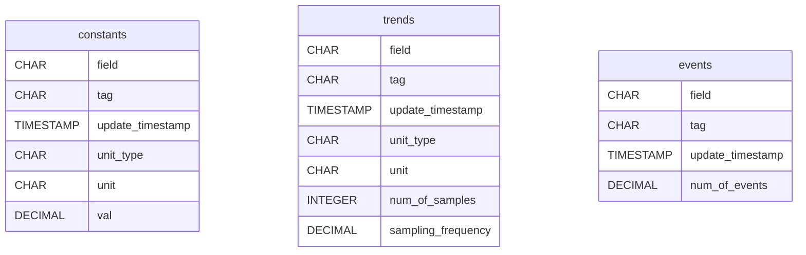
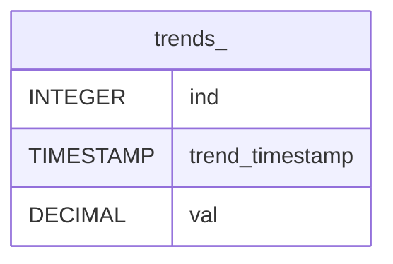
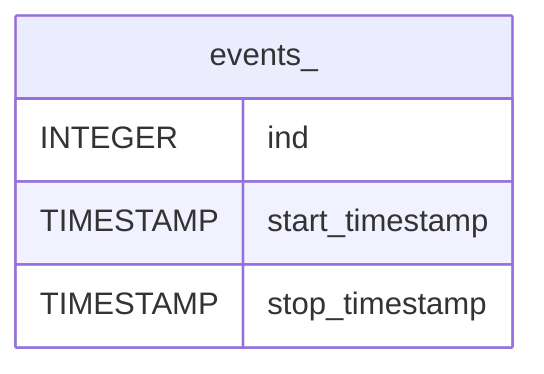
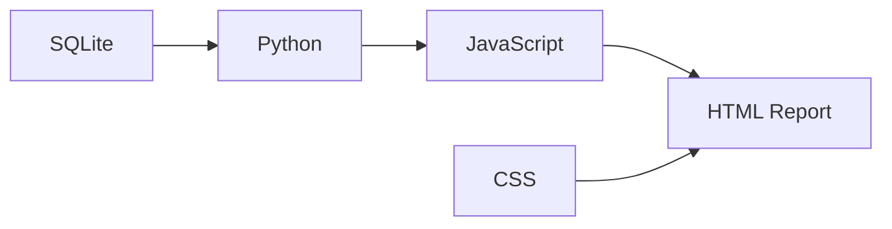

# **Project: Automatic Report Generation Using Python/JavaScript**

This is a testing project where Python and JavaScript is used for automatic report generation.

A database in SQLite plays as the source of the data, from where a HTML-based report is generated. The HTML report is comprehensive and dynamic, in the sense that:

- It is a stand-alone HTML file, with everything, including the data points in the plots, integrated into the file itself.

- The user can interact with the report, for example by selecting what information to display using check boxes, and zooming in and out to see details of the figures.

Python is used to read and process the data exported from SQLite. `Plotly.py` is used to handle the figures, including generating necessary JavaScript codes for the dynamic interaction with the plots. Finally, JavaScript and CSS are used to decorate the report.

For demonstration purpose, artificial "fake" data is used in the SQLite database. A separate Python script is used to generate that SQLite database.

# SQLite Database

The SQLite database `source.db` plays as the data source, from where the report is originated. The following tables are defined. They are not inter-connected.

Each trend and event would have a table of its own, named by `trends_<field>` and `events_<field>` respectively. For example, a trend would result in the following table.

An event would result in the following table.

For an event named `event_1`, an additional column `likelihood_overflow` is given, where the values in this column is a decimal number between 0 and 1.

# Design of the Report

## Components

The following components are required in the HTML report.

| Component | Description                                    |
| :-------- | :--------------------------------------------- |
| Title     | Title of the Report                            |
| Text      | Plain text in paragraphs                       |
| Header    | Headers of different layers                    |
| Table     | Tables, including table indices and captions   |
| Image     | Images that can be dynamically interacted with |
| Link      | Links to a local or remote address             |

Note: 
- It is possible that paragraphs of text and images be integrated into the table cells.
- Images shall be grouped, and images in the same group may share some similar features, such as x-axis scales.

## General Design

The report shall contain a summary. In the summary, the statistics of each table should be given. When showing statistics for the trends, the user should be able to "filter" the trends by the events, both by a particular occurrence of an event, and by accumulated occurrences of an event.

The report shall contains the tables that reflect the tables in the database.

The report shall contains images of plots of the trends. The trends can be plotted on separate images, or on the same image with each trend plotted in a curve. Dynamic images shall be used, where user can interact with the images and perform operations such as zooming. Images shall be grouped, and images in the same group may share some similar features, such as x-axis scales. Images shall be filterable by events, both by a particular occurrence of an event, and by accumulated occurrences of an event. Images shall be able to integrated into tables.

The above describes the possible items to be included in the report. In practice, it should be configurable to choose which items among the above to be actually included in the report.

# Program

## General Design

The HTML and CSS files shall be static. The CSS file can be a separate file, or can be integrated into the HTML file. The JavaScript is dynamically generated by a python program. The actual data collected from the database shall be included in the JavaScript script.

The following figure describes the general design introduced above.

## HTML

## CSS

## JavaScript

## Python

# Appendix

## JavaScript Programming

## Plotly